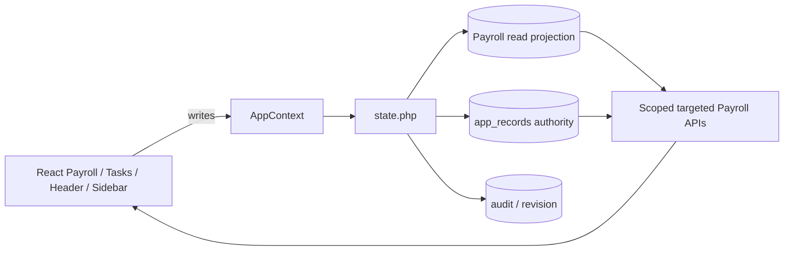

# Phase 9: Payroll and Work Group targeted reads

## Scope and prior architecture

Read alongside the Phase 1–8 reports. The five-second `AppContext` state poll, `state.php`, `load_state()`, `app_records`, Payroll mutations, audit, and revision remain in place. All new frontend flags default off.

The state write transaction persists changed Payroll JSON, updates the projection, writes audit and revision, then commits. A projection error rolls back the transaction. The original JSON remains the source for details; indexed projection columns select only authorized IDs and derived progress. The read endpoints do not call `load_state()`.

## Payroll and Work Group architecture before

`payrollBatches` holds the registration, owner, desks, stage definitions, attachment references, workflow history, and an aggregate progress snapshot. `payrollItems` holds barcode, claimant/title, employment classification, stage/status, verification, hold and assigned user. `workGroups` links batch and item IDs to a processor or team, with operational status and audit history. A `SINGLE_ENTRY` Payroll item accompanies a normal Payroll `documents` voucher. Routing rules and workflow templates are configuration. Batch items drive progress; `payroll_attach_batch_progress()` recomputes it on whole-state reads. The frontend formerly traversed all three Payroll collections for its lists, tasks, detail, Header and Sidebar.

Work Groups are both configuration and operational data. Team/personnel routing rules are low-frequency configuration. Assigned groups, membership and `In_Progress` status are live processing data. Only the latter moved into the Payroll projection; the configuration editor remains on AppContext.

## UI read dependency matrix

| Surface | Before: collection and semantics | After with Payroll flag | Freshness / writes |
| --- | --- | --- | --- |
| Management batch grid/list | Owned batches; office/stage; encoded date; progress/counts | Owned, filtered, 10-row page plus metrics | On load, focus, revision, visible 5-second refresh; register/edit/delete use legacy writes |
| Batch detail | Scoped batch, item/work-group membership, holds, history | Authorized batch; 25 item and 25 group rows/page, aggregate item counts | On open, page, focus, revision, visible refresh; all mutations through AppContext |
| Payroll items | Stage, verification, hold, employment and barcode within batch | Scoped item page and aggregate counts | Same as detail; compliance/check/routing writes unchanged |
| Individual voucher | Owned Payroll document from `documents` | 10-row owned normalized-document page; Detail flag independently controls document detail | On load/focus/revision/visible refresh; document writes unchanged |
| My Tasks Payroll cards | Noncompleted batch with initial desk + initial item, assigned active group, or release desk + releasable item; ID order | 25-row task page and independent all-task count | Visible 5-second refresh, revision, focus; route/check/process writes unchanged |
| Held Payroll items | Initial-stage hold/recheck/ready-after-hold at initial desk | 25-row held page, associated scoped batches | Same as Tasks; compliance writes unchanged |
| Header Payroll search | Exact barcode/batch reference, then partial batch/item fields, authorized result IDs | Compact exact and bounded 100 batch/100 item partial results | Submit only; open selected batch by targeted detail |
| Header Payroll notifications | Noncompleted held owner, initial desk, group processor/team or release desk; priority title and newest timestamp | Bounded 25 Payroll notifications from shell summary | Visible 5-second summary, revision, focus |
| Sidebar Payroll badge | Count of active task batches | Compact shell count | Same summary refresh |
| Work Group processing | Scoped group and member items inside batch detail | 25-row group page, member-index authorization and task group lookup | Operational refresh through detail/Tasks |
| Work Group configuration | Routing rules, users, workflow templates | AppContext remains | Load, mutation and global poll; low-frequency configuration |

The dormant Management `workgroups` and `items` tabs are redirected to the two supported register tabs by existing UI behavior. The active Work Group workspace is batch detail and My Tasks. No separate configuration poll was added.

## Storage decision

Direct `app_records` JSON predicates would scan every Payroll record for tasks, identifiers, membership and counts. The 10,000-item fixture makes whole state ~7.20 MB and 11.07 seconds. A narrow hybrid projection was chosen: `payroll_read_batches`, `payroll_read_items`, `payroll_read_groups`, and `payroll_read_group_items`. There are no new write authorities or invented assignment/history entities. Batch progress is a derived JSON snapshot in the read projection because old source JSON can contain stale progress while whole-state reads recalculate it. Backfill and transactional writes recompute the snapshot from child items; source hashes still identify original JSON. `scripts/backfill_payroll_reads.php --apply` fills it and `--verify` checks source hashes, counts, group links and progress. Run `php scripts/install.php` before backfill. The backfill is rerunnable.

## Targeted API and authorization

The backend gate is `HRMDO_PAYROLL_TARGETED_READS_ENABLED=1`; the frontend gate is `VITE_PAYROLL_TARGETED_READS=1`. Both are off by default. Endpoints: `payroll_batches.php`, `payroll_batch.php`, `payroll_tasks.php`, `payroll_held.php`, `payroll_single.php`, `payroll_search.php`, `payroll_shell_summary.php`. IDs are selected through indexed scope predicates before JSON is loaded. Page defaults are 10 for Management and voucher pages, 25 for tasks/items/groups/held; limit maximum is 100. Exact search returns one authorized batch/item; partial search counts matches but returns at most 100 of each type. No endpoint returns all Payroll state.

The SQL predicates mirror `can_view_full_payroll_batch`, `can_view_payroll_item`, `can_view_work_group`, desk assignment, admin/supervisor capability, encoder ownership and `canRelease`. A limited processor receives a redacted parent batch and only visible items and groups. A guessed batch ID, barcode or search term cannot bypass scope. `payroll_single.php` uses owned normalized Payroll documents, matching the existing Management register; the document Detail flag is independent. Unauthorized exact search is indistinguishable from no authorized exact match. No API error falls back to full-state Payroll data.

The batch workflow audit currently combines full batch history with the item histories on the visible item page. For a multi-page batch, operators must page through items to inspect other item histories. Group completion acts on the currently visible group items, while the existing batch route mutation still validates the entire batch. The UI shows aggregate ready/hold counts and tells users to choose pool processors across pages before routing. A dedicated paginated audit/selection service is a follow-up if very large single batches become common.

## Refresh and rollback

Task queue, held items, open batch detail, Management lists and shell summary refresh while visible every five seconds, on focus and after `stateRevision` changes. Search fetches only on submit. Configuration still follows shared state. Each existing Payroll mutation commits through AppContext, updates revision, then relevant mounted targeted resources refresh. Rollback: set `VITE_PAYROLL_TARGETED_READS=0` and rebuild; disable the backend gate after clients are rolled back. Keep projection tables and original records for diagnosis; do not drop them during rollback. Verify projection before enabling the flag. The full-state poll stays unchanged.

## Phase 8 document shell query

The original actionable count and notification list each evaluated the visibility scope, including a correlated prior-workflow participant lookup. `EXPLAIN` on 10,000 documents showed a primary document scan/range plus `index_subquery` on visibility rows for ~150 participant references. Attention membership already implies visibility through the owner-held or actionable current-step condition, so removing the redundant scope only from those attention queries preserves membership. This is an inference from the actual predicates and was verified by Phase 8 API parity tests and equal 25 notification IDs/counts in the same load fixtures. The read remains two passes (count and 25 rows); no new denormalization or search engine was added.

| Documents | Old count ms | New count ms | Old list ms | New list ms |
| ---: | ---: | ---: | ---: | ---: |
| 100 | 3.47 | 1.40 | 3.97 | 1.83 |
| 1,000 | 18.33 | 8.05 | 20.87 | 10.48 |
| 10,000 | 318.00 | 231.36 | 440.78 | 319.45 |

Medians are isolated SQL timings from `scripts/benchmark_phase9_shell.mjs`; HTTP includes PHP and transport and will be higher. The 10,000-row plan still scans/ranges thousands of documents. Phase 8 partial substring search remains a documented scan; Phase 9 did not expand it into a search project.

## Representative Payroll load and query plans

Disposable fixture: 10 items per batch, 10/100/1,000 batches at 100/1,000/10,000 items. Three median HTTP requests per endpoint, localhost PHP/MariaDB, worker with initial desk assignment, one browser-independent Node client. Timing is illustrative, not a production SLA. `rows` below are total matching rows where shown; page payloads remain bounded.

| Items | Whole-state bytes / ms | Batch page bytes / ms | Tasks bytes / ms | Shell bytes / ms | Exact search ms | Common partial ms |
| ---: | ---: | ---: | ---: | ---: | ---: | ---: |
| 100 | 79,514 / 34.9 | 16,839 / 33.5 | 21,573 / 38.4 | 2,445 / 38.8 | 28.7 | 36.4 |
| 1,000 | 724,645 / 110.2 | 16,851 / 33.5 | 53,855 / 53.2 | 6,031 / 63.3 | 26.3 | 66.5 |
| 10,000 | 7,201,956 / 11,071.4 | 16,863 / 42.4 | 53,858 / 102.8 | 6,032 / 109.1 | 36.2 | 121.4 |

At 10,000, list matches 1,000 batches but returns 10; task matches 1,000 but returns 25; shell count is 1,000 but returns at most 25 notifications. Common partial counts 11,000 batch+item matches while returning at most 200 compact rows; rare partial took 278 ms. A batch detail page was ~7.4 KB and 32 ms in this fixture. Memory was not measured reliably across PHP requests, so none is claimed. Whole-state 10,000 time reflects repeated high-cost JSON load/filter rather than transfer alone.

`scripts/phase9_payroll_plans.php` records `EXPLAIN`: owned batch page uses `idx_prb_owner_date` (`ref`), item page uses `idx_pri_batch_number` (`ref`), group page uses `idx_prg_batch` (`ref`), group membership uses `idx_prgi_item` (`ref`), and exact barcode uses `idx_pri_barcode` (`ref`). These indexes support actual page/scope/search predicates. Partial `%term%` still scans candidate rows. Projection indexes add write cost, but are limited to high-frequency selectors.

## Remaining whole-state dependencies and polling readiness

| Class | Remaining consumers | What a slower global poll changes |
| --- | --- | --- |
| A: high-frequency operational | Dashboard live totals and recent activity; Leave/EWP current status and custody; document detail with Detail flag off; Workflow Manager operational assignments | Cross-user changes appear later; this is the main Phase 10 gate |
| B: moderate display/reporting | Audit report, Dashboard history, Users dashboard summaries, archive and migration panels | Reports and totals lag until refresh/focus |
| C: low-frequency configuration | Classifications, system roles, designations, users, workflow templates, employment routing, appearance settings | Other users' configuration changes appear later; mutation locally refreshes |
| D: write-only/validation support | Register/edit forms reading templates, routing rules, users, classifications and current revision; whole-state conflict checks | A stale form may present old options, although server validation/revision still rejects conflicting writes |

With every targeted flag on, Payroll and document Registry/Detail/Tasks/Header/Sidebar operational reads have their own refresh. At **15 seconds**, remaining Dashboard/Leave/EWP and configuration views can lag by up to ~15 seconds between visible polls. At **30 seconds**, the same views and open forms can show half-minute-old user/routing choices, increasing rejected stale submissions. At **60 seconds**, leave/EWP operational handoffs and Dashboard counts may be a minute late, which is material for active staff. With **focus/post-mutation only**, cross-user updates to those remaining surfaces will not arrive while a tab stays visible and idle; local writes still refresh. None of these modes was implemented. Phase 10 should measure those A dependencies and define their own freshness before changing global polling.

## Browser baseline and tests

The repeated default-build broad sweep yielded **13 passed, 15 failed, 5 skipped**, matching Phase 8. Six failures in `app.spec.ts` target old labels or controls (`Operational Overview`, `Payroll Management & Processing`, fixed `2026-09-14` calendar button, `Change Assignee`) and are stale expectations. Four `detail-targeted.spec.ts` failures expect Detail targeted behavior with the default-off Detail flag. Two `registry-targeted.spec.ts` failures expect Registry targeted behavior with its default-off flag. The remaining three are `payroll-detail.spec.ts`: two expect the old `Routing Settings` button, which the current Workflow Manager does not render; one expects an administrator to lack `Verify & Sign` although the current administrator override exposes it. These are stale UI/authorization expectations, consistent with the existing administrator-override integration baseline. No application behavior was changed solely to satisfy old assertions. There is no evidence that test isolation caused any of these 15 failures.

Phase 2–9 targeted API tests pass (11/11). Integration remains 24/26 with the same two administrator-override assertions documented in earlier phases; there is no new integration failure. TypeScript lint, PHP syntax and production build pass. The focused Phase 9 API fixture compares authorized state batch IDs, scoped detail, task count, notification membership and search for admin, owner, group processor and unrelated user. Backfill verifies hashes/counts and derived progress. The new Phase 9 browser smoke test passed with Payroll targeted mode and its backend gate enabled: it observed shell, list and detail requests and opened a seeded batch. A combined all-targeted-flags focused sweep gave 9 passed, 5 failed, 1 skipped; those older fixtures do not enable the Payroll backend gate, so that combination is not a valid all-flags gate. With the Payroll flag off and the document Detail/Tasks/Search/Shell flags on, the relevant focused sweep gave 9 passed, 2 failed, 1 skipped. One Detail test timed out after a reload with its deliberately delayed response and remains unresolved; the other expected a Registry API request while the Registry flag was off. The broad default browser baseline is a classification input, not a green regression gate.

## Phase 10 recommendation

Prioritize remaining A operational readers, particularly Leave/EWP and Dashboard freshness, and measure their read/response cost and cross-user update requirements. Decide a per-resource refresh policy and rerun correctly flagged browser suites before considering any change to the five-second global poll. Phase 10 is not implemented here.
